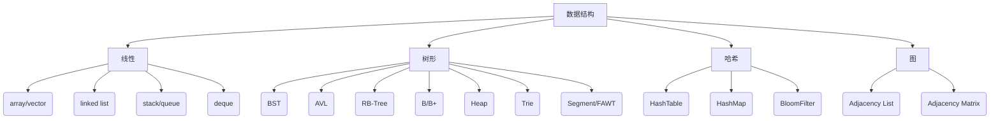

# 数据结构全景指南  
> 从底层原理到工程落地的“寻宝图”

---

## 1. 什么是数据结构？
**官方定义**：相互之间存在一种或多种特定关系的数据元素的集合。  
**人话**：把数据“结构化”地塞进内存，让**存得快、取得准、省得狠**。

---

## 2. 为什么必须学？
| 场景 | 用错结构 | 用对结构 |
|---|---|---|
| 1 亿条日志去重 | `vector`+暴力比对，内存爆炸 | `BloomFilter` 毫秒级、99 % 准确率 |
| 10 w 级别中间结果排序 | 每次 `qsort` CPU 飙红 | 小顶堆实时 Top-K，O(n log k) |
| 千万级并发缓存 | 全局锁，线程饥饿 | 分段 `ConcurrentHashMap`，锁粒度降低 1000× |

---

## 3. 速览家族图谱


---

## 4. 明星结构拆解

结构	核心语义	杀手锏	经典落地	
动态数组	可扩容的连续块	O(1) 随机访问	STL vector、Redis SDS	
链表	指针串飞线	O(1) 插入/删除	Linux 内核 task 链表	
跳表	多级索引 highway	替代平衡树，并发友好	Redis ZSet、LevelDB	
B+ 树	多叉+有序+叶链	磁盘预读 & 范围扫描	MySQL InnoDB 索引	
哈希表	散列+桶+冲突链	均摊 O(1)	Java HashMap、Go map	
布隆过滤器	位图+多哈希	节省 50 % 内存，宁可错杀	CDN 缓存穿透拦截	
并查集	森林+路径压缩	动态连通性近乎常数	Kruskal、朋友圈合并	
最小堆	完全二叉+父≤子	O(1) 查最值	Dijkstra、定时器	
前缀树	字符共享前缀	省内存，支持前缀匹配	搜索引擎提示、路由表	
LRU	哈希+双向链表	O(1) 读写+淘汰	Redis、OS 页置换	

---

## 5. 时空复杂度速查表

操作	Array	LinkedList	SkipList	BST	AVL	RB	B+	Hash	Heap	
随机访问	O(1)	O(n)	O(log n)	O(log n)	O(log n)	O(log n)	O(log n)	O(1)	O(1)	
插入	O(n)	O(1)	O(log n)	O(log n)	O(log n)	O(log n)	O(log n)	O(1)	O(log n)	
删除	O(n)	O(1)	O(log n)	O(log n)	O(log n)	O(log n)	O(log n)	O(1)	O(log n)	
范围查询	—	O(n)	O(log n)	O(log n+k)	O(log n+k)	O(log n+k)	O(log n+k)	—	O(k)	

> Heap 仅支持查最值，非随机访问

---

## 6. 工程级选型 Tips
1. 读多写少 & 有序 → 红黑树（C++ map、Java TreeMap）  
2. 内存敏感 & 近似成员 → BloomFilter + 哈希表双层架构  
3. 高并发缓存 → 分段锁 + LRU 链表（Memcached）  
4. 磁盘索引 → B+ 树，节点大小 = 页大小（4 KB）  
5. 实时 Top-K → 小顶堆，容量固定 K，内存可控  
6. 字符串关键词匹配 → Trie 树 + AC 自动机（多模式串）  

---


## 7. 一键实战：LRU 缓存

```python
from collections import OrderedDict

class LRUCache(OrderedDict):
    def __init__(self, capacity: int):
        self.cap = capacity

    def get(self, key: int) -> int:
        if key not in self:
            return -1
        self.move_to_end(key)          # 变最新
        return self[key]

    def put(self, key: int, value: int) -> None:
        if key in self:
            self.move_to_end(key)
        self[key] = value
        if len(self) > self.cap:
            self.popitem(last=False)   # 踢最老
```

复杂度：O(1) 读写 + O(1) 淘汰

---

## 8. 下一站
- 并发数据结构（跳表 vs 哈希的锁粒度对比）  
- 持久化数据结构（Copy-on-Write、Bε-tree）  
- 内存布局与缓存友好（B+ 树节点填充因子、CPU Cache Line）  

> 持续更新，Star 不迷路 🚀

```