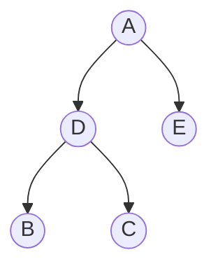
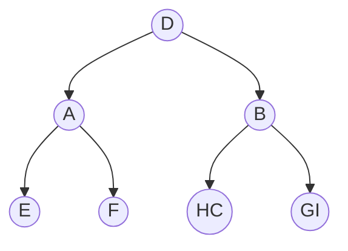
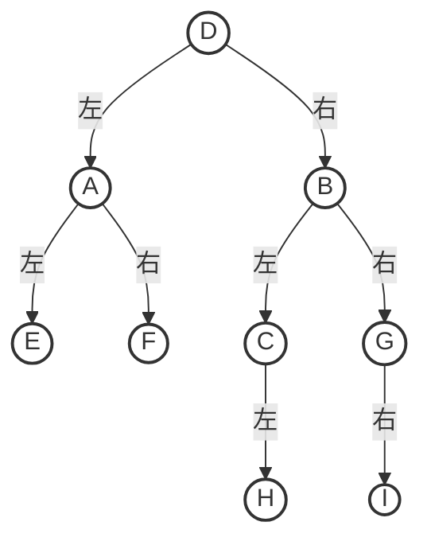

import TreeTraversalGallery from '@site/src/components/AlgoScenes/TreeTraversalGallery';

二叉树的遍历是指按某条搜索路径访问树中每个结点，使得每个结点均被访问一次，而且仅被访问一次。

## 动态演示：四种遍历方式对比

点击上方按钮切换不同的遍历算法。
**层序遍历**还会展示辅助队列的变化过程，这是理解 BFS 的关键。

<TreeTraversalGallery />

### 1. 先中后序遍历规则
- 先序遍历（NLR）：根结点 → 左子树 → 右子树；
- 中序遍历（LNR）：左子树 → 根结点 → 右子树；
- 后序遍历（LRN）：左子树 → 右子树 → 根结点。

### 2. 先中后序代码实现
```cpp
// 访问结点（示例：打印值）
void visit(BiTree T) {
    printf("%d ", T->data.value);
}

// 先序遍历
void PreOrder(BiTree T) {
    if (T != NULL) {
        visit(T);
        PreOrder(T->lchild);
        PreOrder(T->rchild);
    }
}

// 中序遍历
void InOrder(BiTree T) {
    if (T != NULL) {
        InOrder(T->lchild);
        visit(T);
        InOrder(T->rchild);
    }
}

// 后序遍历
void PostOrder(BiTree T) {
    if (T != NULL) {
        PostOrder(T->lchild);
        PostOrder(T->rchild);
        visit(T);
    }
}
```

### 3. 应用：求树的深度
```cpp
int treeDepth(BiTree T) {
    if (T == NULL) return 0;  // 空树深度为0
    int l = treeDepth(T->lchild);  // 左子树深度
    int r = treeDepth(T->rchild);  // 右子树深度
    return l > r ? l + 1 : r + 1;  // 树的深度=Max(左右子树深度)+1
}
```

### 4.二叉树的层序遍历
算法思想
- 初始化一个辅助队列
- 根结点入队
- 若队列非空,则队头结点出队,访问该结点,并将其左,右孩子插入队尾(如果有的话)
- 重复上一步直至队列为空


### 5.层序遍历代码实现

import CppRunner from '@site/src/components/CppRunner';

<CppRunner initialCode={`#include <stdio.h>
#include <stdlib.h>
/* ================= 二叉树结点 ================= */
typedef struct BiTNode {
    char data;                  // 结点数据域
    struct BiTNode *lchild;     // 左孩子指针
    struct BiTNode *rchild;     // 右孩子指针
} BiTNode, *BiTree;             // BiTNode 是结构体，BiTree 是结构体指针
/* ================= 链式队列 ================= */
// 队列的结点类型
typedef struct LinkNode {
    BiTree data;                // 存放“二叉树结点指针”
    struct LinkNode *next;      // 单链表指针
} LinkNode;
// 队列的头尾指针封装
typedef struct {
    LinkNode *front;   // 队头指针（带头结点）
    LinkNode *rear;    // 队尾指针
} LinkQueue;
/* ---------- 队列基本操作 ---------- */
// 1. 初始化队列（创建头结点，front/rear 都指向它）
void InitQueue(LinkQueue &Q) {          // C++ 引用，方便修改实参
    Q.front = Q.rear = (LinkNode *)malloc(sizeof(LinkNode));
    Q.front->next = NULL;               // 头结点 next 为空
}
// 2. 判空：队头 == 队尾 说明队列空
bool IsEmpty(LinkQueue Q) {
    return Q.front == Q.rear;
}
// 3. 入队：在队尾插入一个新元素
void EnQueue(LinkQueue &Q, BiTree e) {
    LinkNode *s = (LinkNode *)malloc(sizeof(LinkNode));
    s->data = e;         // 存二叉树结点指针
    s->next = NULL;      // 新结点作为新的尾结点
    Q.rear->next = s;    // 原尾结点指向新结点
    Q.rear = s;          // 更新尾指针
}
// 4. 出队：把头结点后面的第一个真正结点删掉
bool DeQueue(LinkQueue &Q, BiTree &e) { // 用 e 把值带出去
    if (IsEmpty(Q)) return false;       // 空队列无法出队
    LinkNode *p = Q.front->next;        // p 指向要删除的结点
    e = p->data;                        // 取出数据
    Q.front->next = p->next;            // 头结点跳过 p
    if (Q.rear == p)                    // 如果删的是最后一个元素
        Q.rear = Q.front;               // 尾指针重新指向头结点
    free(p);                            // 释放被删结点
    return true;
}
/* ================= 层序遍历 ================= */
// 访问函数：这里简单打印字符
void visit(BiTree T) {
    printf("%c ", T->data);
}
// 核心：层序遍历（广度优先）
void LevelOrder(BiTree T) {
    if (!T) return;         // 空树直接返回
    LinkQueue Q;
    InitQueue(Q);           // 1. 初始化辅助队列
    EnQueue(Q, T);          // 2. 根结点入队
    while (!IsEmpty(Q)) {   // 3. 队列不空就循环
        BiTree p;
        DeQueue(Q, p);      // 3.1 队头出队
        visit(p);           // 3.2 访问该结点
        if (p->lchild)      // 3.3 左孩子存在则入队
            EnQueue(Q, p->lchild);
        if (p->rchild)      // 3.4 右孩子存在则入队
            EnQueue(Q, p->rchild);
    }
}
/* ================= 测试：手动建一棵二叉树 ================= */
// 快速创建一个结点
BiTree CreateNode(char c) {
    BiTree t = (BiTree)malloc(sizeof(BiTNode));
    t->data = c;
    t->lchild = t->rchild = NULL;
    return t;
}
int main() {
    /* 构造下图这棵树
            A
          /   \
         B     C
        / \   /
       D   E F
    */
    BiTree A = CreateNode('A');
    BiTree B = CreateNode('B');
    BiTree C = CreateNode('C');
    BiTree D = CreateNode('D');
    BiTree E = CreateNode('E');
    BiTree F = CreateNode('F');
    A->lchild = B; A->rchild = C;
    B->lchild = D; B->rchild = E;
    C->lchild = F;
    printf("LevelOrder: ");
    LevelOrder(A);   // 预期输出：A B C D E F
    return 0;
}
`} />


### 6.由遍历序列构造二叉树

- 前序遍历的第一个字符就是根结点,所以A为根结点;
- 再看中序遍历,顺序为左根右,所以A左边的BDC即为左子树,E为右子树
- 再看BDC子树,D左边的为左孩子,右边的为右孩子,得到下图:


- 首先观察可以得到根结点为D;D左侧的EAF为左子树,右侧的BCHGI为右子树;
- 再看前序遍历中B在前面,所以B为右子树根结点,HC为左子树,GI为右子树;得到下图:

- 然后根据前序遍历中的根左右,中序遍历中的左根右的顺序,判断出CG为根,最终为:




**- `结论：前序、后序、层序序列的两两组合无法唯一确定一棵二叉树;一定要有中序序列!
`**
